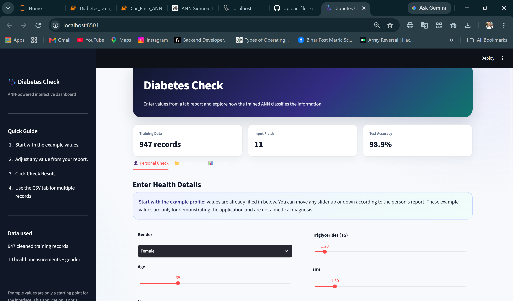

# 🩺 Diabetes Prediction using Artificial Neural Network

<p align="center">
  <b>An interactive Streamlit application for diabetes classification using TensorFlow/Keras ANN.</b><br>
  Enter individual health values, modify them interactively, or upload a CSV to generate predictions.
</p>

<p align="center">
  
  
  
  
  
</p>

---

## 📸 App Preview



---

## 📌 Project Overview

This project demonstrates a complete **data analysis → data cleaning → machine learning → ANN → Streamlit deployment** workflow for a diabetes classification problem.

The project starts with the supplied diabetes CSV dataset, performs basic data cleaning and preparation, converts the target into a binary classification task, trains an Artificial Neural Network, and provides an interactive web interface for new inputs.

### What the application can do

- 👤 Enter an individual's health/lab values manually
- 🎚️ Adjust input values interactively
- 🧠 Generate an ANN-based classification
- 📂 Upload a CSV containing multiple records
- 📊 View the cleaned training dataset
- 📥 Download prediction results as CSV
- ⚠️ Warn when entered values are outside the ranges observed in training data

---

## 🗂️ Project Structure

```text
Diabetes-Prediction-ANN/
│
├── app.py
├── README.md
│
├── data/
│   └── Dataset of Diabetes.csv
│
├── preview/
│   └── ann.png
│
├── Diabetes_Data_Analysis_Cleaning_Train_Test.ipynb
│
└── scaler.pkl
```

> Keep the dataset inside the `data/` folder so the Streamlit application can load it automatically.

---

## 📊 Dataset

The supplied CSV contains **1,000 records and 14 columns**:

```text
ID
No_Pation
Gender
AGE
Urea
Cr
HbA1c
Chol
TG
HDL
LDL
VLDL
BMI
CLASS
```

The original `CLASS` column contains:

- `Y` → Diabetic
- `N` → Non-Diabetic
- `P` → Predict-Diabetic

For this **binary ANN + Sigmoid** project, the notebook keeps the `Y` and `N` records and excludes `P` from the binary modelling experiment.

The dataset also contains minor formatting inconsistencies such as trailing spaces in some `CLASS` values and a lowercase `f` in `Gender`; these are cleaned before modelling.

---

## 🔍 Data Analysis & Cleaning Workflow

The notebook follows a simple data-analyst workflow:

```text
Raw CSV
   ↓
Read Dataset
   ↓
Basic Inspection
   ↓
Shape / Info / Describe
   ↓
Missing Value Check
   ↓
Duplicate Check
   ↓
Unique Value Check
   ↓
Text Cleaning
   ↓
Duplicate Removal
   ↓
Remove ID Columns
   ↓
Binary Target Preparation
   ↓
One-Hot Encoding
   ↓
Separate X and y
   ↓
Train-Test Split
   ↓
Feature Scaling
   ↓
ANN Model
```

### Data preparation highlights

- Removes extra spaces from text values
- Standardizes `Gender`
- Standardizes `CLASS`
- Removes duplicate rows
- Removes identifier columns (`ID`, `No_Pation`)
- Keeps the required binary classes for the sigmoid model
- Converts `CLASS` into a binary target internally
- Uses simple one-hot encoding for `Gender`
- Splits data into **80% training and 20% testing**
- Uses `stratify=y` to preserve class proportions
- Applies `StandardScaler` before ANN prediction

---

## 🧠 ANN Architecture

The neural network used in the application follows this structure:

```text
Input Layer
    ↓
Dense(11) + ReLU
    ↓
Dense(8) + ReLU
    ↓
Dense(6) + ReLU
    ↓
Dense(4) + ReLU
    ↓
Dense(1) + Sigmoid
```

### Model configuration

| Component | Configuration |
|---|---|
| Model | Artificial Neural Network |
| Hidden activation | ReLU |
| Output activation | Sigmoid |
| Optimizer | Adam |
| Loss | Binary Crossentropy |
| Training split | 80 / 20 |
| Batch size | 16 |
| Epochs | 30 |

The application displays the human-readable prediction labels **Diabetic** and **Not Diabetic** rather than exposing the internal numeric class representation in the main UI.

---

## 🖥️ Streamlit Features

### 👤 Personal Check

The user can enter values for:

- Gender
- Age
- Urea
- Creatinine
- HbA1c
- Cholesterol
- Triglycerides
- HDL
- LDL
- VLDL
- BMI

The input controls are interactive, so values can be adjusted up or down according to the available report data.

### 📂 CSV Prediction

A CSV containing multiple records can be uploaded and processed in one go.

The app returns:

- Original input data
- Prediction label
- Model output score

Prediction results can then be downloaded as a CSV file.

---

## 🚀 Run the Project Locally

### 1. Clone the repository

```bash
git clone https://github.com/<your-username>/<your-repository>.git
cd <your-repository>
```

### 2. Install dependencies

```bash
pip install pandas numpy scikit-learn tensorflow streamlit
```

### 3. Start the Streamlit app

```bash
streamlit run app.py
```

The app will open in your browser.

---

## 📁 CSV Format for New Predictions

For the CSV upload feature, use the following columns:

```text
AGE,Urea,Cr,HbA1c,Chol,TG,HDL,LDL,VLDL,BMI,Gender
```

Example:

```csv
AGE,Urea,Cr,HbA1c,Chol,TG,HDL,LDL,VLDL,BMI,Gender
35,4.5,60,5.2,4.2,1.2,1.5,2.2,0.5,22.5,F
50,7.1,92,7.0,5.8,2.4,1.0,3.7,1.1,29.4,M
```

The application can also handle common variations in some column names, such as `Age`, `Creatinine`, `HbA1c`, `Cholesterol`, `Triglycerides`, `HDL`, `LDL`, `VLDL`, and `BMI`.

---

## 🛠️ Tech Stack

**Programming & Data**
- Python
- Pandas
- NumPy

**Machine Learning**
- Scikit-learn
- StandardScaler
- Train-Test Split

**Deep Learning**
- TensorFlow
- Keras
- Artificial Neural Network
- ReLU
- Sigmoid

**Frontend / Deployment**
- Streamlit

---

## 📓 Notebook

The Jupyter Notebook documents the preprocessing stage from the raw CSV through the train/test split.

Main notebook:

```text
Diabetes_Data_Analysis_Cleaning_Train_Test.ipynb
```

---

## ⚠️ Important Note

This project is intended for **learning, data analysis, machine-learning practice, and demonstration purposes**.

The application's output is generated by a machine-learning model trained on the supplied dataset. It should **not** be treated as a medical diagnosis or as a substitute for professional medical advice.

---

## 👨‍💻 Author

**Roshan Kumar**

Data Analysis • Python • SQL • Power BI • Machine Learning • ANN

---

## ⭐ Project Highlights

```text
Data Cleaning
     +
Exploratory Data Checks
     +
Feature Preparation
     +
Train/Test Split
     +
ANN Classification
     +
Interactive Streamlit UI
     +
Real-Input Prediction
     +
CSV Batch Prediction
```

---

### Made with Python, TensorFlow, Keras & Streamlit 🩺
